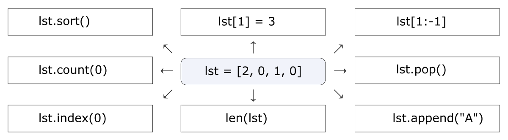
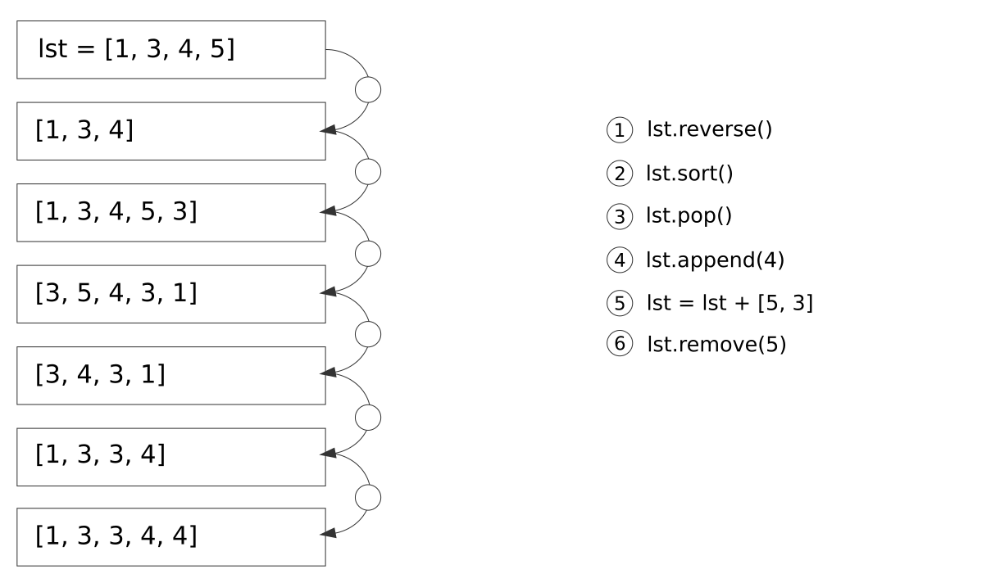

# Pętla for (For loop)

> Kod Pythona na tych zajęciach najłatwiej testować jako skrypt (bez używania interaktywnego wiersza poleceń).

## Zad. 1
Wyjaśnij, co robi poniższy program.

```python
for i in range(1, 10):        # Instrukcje wewnątrz pętli piszemy stosując wcięcia.
    print(i)                  # Do wcięcia możemy używać tabulatora lub kilku spacji (najlepiej 4).  
```


## Zad. 2
Wyjaśnij, co robi poniższy program.

```python
for i in range(1, 10):
    print(i, end = " ")
```


## Zad. 3
Utwórz *pętle for*, która wygeneruje taki wynik:

```
1 4 9 16 25 36 49
```


## Zad. 4
Na czym polega różnica między poniższymi dwoma instrukcjami?

```python
total = 0
for i in range(10):
    total = total + i
print(total)
```

oraz

```python
total = 0
for i in range(10):
    total = total + i
    print(total)
```


## Zad. 5
Ile wynosi `number` oraz `total` po przejściu całej pętli *for*?

```python
total = 0
for number in range(0, 8, 2):
    total += number                # To samo co: total = total + number
```

## Zad. 6
Podaj wynik poniższego kodu. Spróbuj zastanowić się co będzie wynikiem zanim uruchomisz kod.

```python
s = 'bioinfo'
for i in range(len(s)):
    print(s[i])
```

## Zad. 7
Jaką wartość będzie miała zmienna `s2` w obu poniższych instrukcjach?

```python
s1 = 'bioinfo'
s2 = ''
for letter in s1:                 # Stringi są obiektami iterowalnymi. Oznacza to, że możemy  
    s2 += letter                  # używać pętli for do przechodzenia litera-po-literze.
```

oraz

```python
s1 = 'bioinfo'
s2 = ''
for i in range(len(s1)):
    s2 += s1[i]
```


# Instrukcja if

## Zad. 8
Do poniższego kodu dodaj warunek sprawdzający, czy użytkownik ma `21` lat lub więcej.

```python
age = 23
if age > 18:
    print("You are not a minor anymore")
elif age > 16:
    print("You can drive a car")
elif age > 13:
    print("You can get ice cream")
elif age > 5:
    print("You can get candy")
else:
    print("You need a nap") 
```


## Zad. 9
Uruchom poniższy skrypt. Następnie zmodyfikuj jego kod, aby zamienił podaną przez użytkownika wartość temperatury w stopniach Celsjusza na Fahrenheita (T<sub>F</sub> = 32 + 9/5 * T<sub>C</sub>).

```python
name = input("Enter your name: ")                        # String
temp = float(input("Enter temperature in Celsius: "))    # Floating number

print(name)
print(temp)
```

Output:

```
Enter temperature in Celsius: 4
Temperature in Fahrenheit: 39.2  
```


## Zad. 10
Poniższy program wypisuje na ekran wszystkie pozycje adeniny w sekwencji DNA. Niestety kod zawiera **cztery błędy**. Zmodyfikuj kod, tak aby działał prawidłowo.

```python
seq = "ATGCTGACT" 
position = 1

for char in seq
    if char = "T":
        print(position)
position = position + 1
```


## Zad. 11
Napisz skrypt `02-11.py`, który w opariu o pętle `for` i instrukcje `if` wyświetli w jednej linii sekwencję komplementarną do sekwencji podanej przez użytkownika.

```python
seq = input("Enter a DNA sequence: ")

# ATGCAATC  <-- sekwencja użytkownika
# TACGTTAG  <-- sekwencja komplementarna
```

## Zad. 12
Które z poniższych instrukcji `if` zwrócą prawdę?

1. `if 'A':`
2. `if '':`
3. `if 0:`
4. `if 0 or 2:`
5. `if len('ATG') == 3:`
6. `if 'T' in 'ATG':`
7. `if 'C' not in 'ATG':`
8. `if 3 != 3:`
9. `if ('A' or '') and (2 or 0):`


# Listy (Lists)

## Zad. 13
Sprawdź co zrobi każde wyrażenie z listą w środku (`lst`).




## Zad. 14
Wyjaśnij co robi poniższy kod:

```python
stop_codons = ['TGA', 'TAA', 'TAG']

stop_codons.sort()
for codon in stop_codons:
    print(codon)
```

## Zad. 15
Czy poniższy kod zmodyfikuje listę?

```python
lst = [1, 2, 3]
for number in lst:
    number += 10        # To samo co: number = number + 10
```

## Zad. 16
Czy poniższy kod zmodyfikuje listę?

```python
lst = [1, 2, 3]
for i in range(len(lst)):
    lst[i] += 2
```

## Zad. 17
Podaj wynik poniższego kodu:

```python
lst1 = ['a', 'b', 'c']
lst2 = []
for letter in lst1:
    lst2.append(letter)
print(lst1)
print(lst2)
```

## Zad. 18
Napisz kod, który użyje pętli *for* i z listy `lst1 = ['a', 'b', 'c']` wygeneruje **nową** listę `['aa', 'bb', 'cc']` .


## Zad. 19
Napisz kod, który użyje pętli *for* i przekształci **istniejącą** listę `lst1 = ['a', 'b', 'c']` w `['aa', 'bb', 'cc']`.


## Zad. 20
Za pomocą pętli *for* utwórz listę, która będzie zawierała sumy odpowiadających sobie (na tych samych pozycjach) liczb z listy `human` i `mouse`.

```python
human = [2269, 542, 54, 21]
mouse = [881, 179, 12, 11]

# output = [3150, 721, 66, 32]
```


## Zad. 21
Przyporządkuj odpowiednie wyrażnie po prawej do odpowiedniej strzałki.




## Zad. 22
W puste miejsca (tj. `_`) argumentów funkcji `list(range(_, _, _))` wpisz odpowiednie wartości, aby utworzyć te listy:

* `[4, 7, 10, 13]`
* `[10, 20, 30, 40, 50]`
* `[33, 32, 31, 30]`


## Zad. 23
Rozszyfruj co robią poniższe instrukcje:

```python
lst = [10, 11, 12, 15, 13, 14, 15]

min(lst)                        # 1
max(lst)                        # 2
sum(lst)                        # 3
sum(lst[:3])                    # 4
lst.count(15)                   # 5
```

## Zad. 24
W jednej linii kodu (*one-liner*) oblicz średnią z wartości w liście `lst` poprzedniego zadania.


## Zad. 25
Rozszyfruj w jaki sposób poniższe metody modyfikują listę `lst` z poprzedniego zadania (po wywołaniu metody każdorazowo wyświetl na ekran zawartość `lst`).

```python
lst.remove(15)                  # 1
lst.extend([16, 18, 19])        # 2
lst.insert(7, 17)               # 3
lst.reverse()                   # 4
```


## Zad. 26
Rozszyfruj co robią poniższe instrukcje:

```python
s = 'B  I O I\nF    O R  M\tA T I C S'
```

1. `x = s.split()`
2. `x = s.split('I')`
3. `x = "".join(s.split())`
4. `x = "-".join(s.lower().split())`
5. `x = list(s)`


## Zad. 27
Podaj instrukcje, które z poniższego tekstu utworzą listę i wyświetlą na ekran liczbę wszystkich słów w tym tekście.

```python
text = """The Wellcome Trust Sanger Institute
is a world leader in genome research."""
```


## Zad. 28
Poniższa lista zawiera liczbę wystąpień każdego aminokwasu w sekwencjach aminokwasowych.

```python
counts = [
    'A Ala 130856',
    'C Cys 21703',
    'D Asp 86498',
    'E Glu 106776',
    'F Phe 61151',
    'G Gly 112163',
    'H His 35961',
    'I Ile 94102',
    'K Lys 92360',
    'L Leu 152877',
    'M Met 38179',
    'N Asn 64319',
    'P Pro 74616',
    'Q Gln 62260',
    'R Arg 87607',
    'S Ser 104400',
    'T Thr 84597',
    'V Val 108836',
    'W Trp 17268',
    'Y Tyr 46259'
]
```

Utwórz skrypt `02-28.py`, umieść w nim listę `counts` i napisz instrukcje, które wyświetlą na ekran liczbę wystąpień każdego aminokwasu.

Output:

```
130856
21703
itd.
```


## Zad. 29
Zmodyfikuj skrypt `02-28.py` tak, aby wyświetlić procentową zawartość każdego aminokwasu. Liczba wszystkich reszt aminokwasowych to `1584224`.

Output:

```
A   8.3
C   1.4
...
```

## Zad. 30
Które z poniższych wywołań funkcji `print` zwrócą fałsz.

```python
codons = [['TGA', 'TAA', 'TAG'], ['GAA', 'GAG'], ['TGG'], []]

print(codons[2] == ['TGG'])               # 1
print(codons[0][1] == 'TAA')              # 2
print(codons[0][1][1] == 'A')             # 3
print(codons[3] == False)                 # 4
print('GAA' not in codons[0])             # 5
print(codons[-3][1] == ['GAG'])           # 6
print(codons[-2][-1] == 'TGG')            # 7
```


## Zad. 31
Wyjaśnij, co robią poniższe dwie instrukcje.


```python
codons = [['TGA', 'TAA', 'TAG'], ['GAA', 'GAG'], ['TGG'], []]

for lst in codons:                 # Instrukcja 1
    for codon in lst:              # Czytelna
        print(codon)

print()                            # Pusta linia dla rozdzielenia obu instrukcji

for i in range(len(codons)):       # Instrukcja 2
    lst = codons[i]                # Mniej czytelna
    for j in range(len(lst)):
        print(lst[j])
```