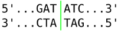
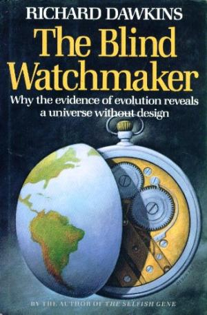

## Zad. 21
Bakterie wykorzystują enzymy restrykcyjne do walki z wirusami. Enzymy restrykcyjne rozpoznają w sekwencjach genomów wirusów palindromowe sekwencje DNA długości od 4 do 12 nukleotydów i w tych miejscach przeprowadzają rozcięcie cząsteczek wirusa. 

Przykładową sekwencją palindromową jest `GATATC`, ponieważ jej sekwencja odwrotnie komplementarna to `GATATC`.



W skrypcie `05-15.py` dodaj funkcję `restriction_sites`, która w zadanej przez użytkownika sekwencji DNA zidentyfikuje pozycję początku i końca wszystkich palindromowych sekwencji długości od 4 do 12 nukleotydów. 

> Wskazówka: Niech funkcja `restriction_sites` skorzysta z już istniejącej funkcji `reverse_complement`.

Input:

```
TCAATGCATGCGGGTCTATATGCAT
```

Output:

```python
[
  [4, 9, 'ATGCAT'],
  [5, 8, 'TGCA'],
  [6, 11, 'GCATGC'],
  [7, 10, 'CATG'],
  [17, 20, 'TATA'],
  [18, 21, 'ATAT'],
  [20, 25, 'ATGCAT'],
  [21, 24, 'TGCA']
]
```

## Zad. 22
 W książce "Ślepy zegarmistrz" Richard Dawkins zaprezentował symulację komputerową, która przedstawia działanie doboru naturalnego w zakresie tworzenia złożonych form biologicznych poprzez losowe mutacje. Symulacja zaczyna się od przypadkowej sekwencji liter i stopniowo przekształca się w hamletowską sentencję **METHINKS IT IS LIKE A WEASEL** (*Zdaje mi się, że jest podobniejsza do łasicy*).

Utwórz skrypt `weasel.py`, który przeprowadzi procedurę Dawkinsa:

1. Wygeneruj losową sekwencję długości 28 znaków (alfabet: 26 liter i spacja).
2. Utwórz 100 kopii tej sekwencji (*reprodukcja*).
3. W każdej kopii sekwencji w jednym losowym miejscu zastąp znak innym przypadkowym znakiem z alfabetu (*mutacja*).
4. Określ, która z 100 kopii sekwencji jest najbardziej zbliżona do docelowej sekwencji METHINKS IT IS LIKE A WEASEL. W tym celu możesz obliczyć [dystans Hamminga](https://pl.wikipedia.org/wiki/Odległość_Hamminga) (liczbę pozycji w sekwencji niezgodnych z sekwencją docelową).
5. Zakończ program jeżeli któraś z 100 kopii sekwencji jest identyczna do hamletowskiej sentencji. W przeciwnym przypadku, wybierz jedną sekwencję, która wykazuje największe podobieństwo i przejdź do kroku 2.

Przykładowy output:

```
TATTIYAKXWTXTFTDXQHOFOYLPTLN  1
TATTIYAK WTXTFTDXQHOFOYLPTLN  2
TATTIYAK WTXTFTDXQHOF YLPTLN  3
TATTIYAK WTXTFTDXQEOF YLPTLN  4
TATTIYAK WTXTFTDXQE F YLPTLN  5
...
METHINKS IT IS LIKE A WEASEL  N
```


Odpowiedz na pytania:

1. Ile pokoleń potrzebnych jest do wygenerowania docelowej sekwencji?
2. Czy symulacja Dawkinsa trafnie odwzorowuje działanie ewolucji?